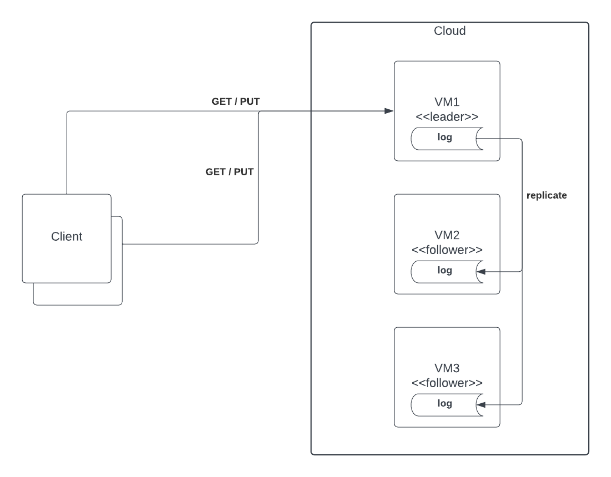
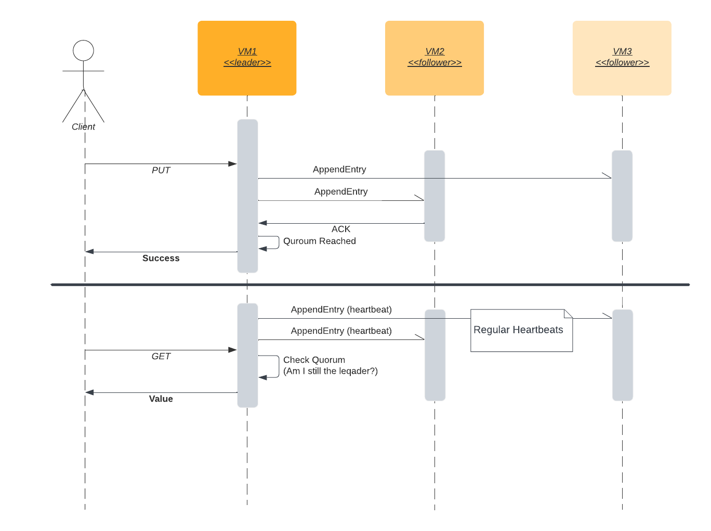

# Distributed Consensus

## Key Considerations

1. *Cloud.* According to the requirement: "the service must run in a cloud environment, which means that it runs on a collection of VMs". The fact we are running on multiple nodes already depicts the high availability scenario - it is obvious we are not relying on a single node for both availability and performance reasons. However requirement does not specifically state how many nodes we are supposed to run. In addition to that there are no particular details about performance (e.g. throughput) and storage options to expect. Thats why will assume its not an issue (not the main concern as of now). It is important to know that some nodes may go offline although it is not clear how often (not an exact SLA).
2. *Ensure Data Consistency.* We can conclude that we should expect a strong consistency model - *GET* should return latest value in our multi-node environment. Our solution should adhere to the linearizability requirement
3. *Maximize Availability.* With strong consistency in mind we should consider that availability in such cases is less important (and, actually is not achievable according to CAP). Performance is also something that degrades with strong consistencies because of additional latencies. But having multiple VMs already assumes we would like to make system more available. Our goal is to ensure availability in case one of the node (e.g. Cloud updates) goes offline. But still the majority of VMs should operate and be able to serve clients.
4. *Favor Consistency over Availability*. We already have decision about being strongly consistent at this point. Its just a client of our API should expect failures at times with proper response codes (e.g. 500/503)

## Key Challenges

- How can the system function in the presence of failures of individual VMs (nodes)?
- How can the system guarantee consistency when multiple nodes are involved?

We can achieve a functioning system by introducing a replication mechanism which will deliver a consensus between nodes (VMs) on the state of key-value store after PUT operation takes place. We need to achieve a consensus (quorum) so that when a node fails we can still serve clients (remain available and strongly consistent). A straightforward solution would be to reach the quorum by communicating between every node in the cluster for each PUT or GET operation so that only latest data is returned. It introduces latencies which in modern world can be reduced by using Raft protocol. So our solution will be based on Raft - a leader based distributed model which is responsible for handling write/read requests and ensuring data is replicated efficiently (through log replication). Raft assumes a specific number of nodes to fulfill requirements, e.g. "for a set of size N , quorum requires at least (N/2)+1 members". We should introduce at least 3 VMs for our solution to work properly. In Raft, the failover is handled by a mechanism called leader election. Raft is linearizable (aka strong consistency) because it handles read and write by the same leader.

## Tasks

- Draw a sequence diagram depicting execution of a typical GET and PUT operation that involves the client and the server.
- List some common failure modes and how the system would handle them.

Below is an example sequence diagram for both PUT and GET API operations. Those follow to some extent Raft protocol, it is suggested to rather look at official Raft documentation.

PUT operation has to reach the quorum and replicate write log respectively from leader to followers respectively. We expect strong consistency as a result of such replication.

GET operation will succeed if leader is still eligible. That is supported by regular heartbeats to check the Quorum and making sure there are no competing leaders in the cluster. 

It is worth mentioning that it is possible to let followers handle Read(GET) requests in order to offload leader. That requires a given follower to check with rest of the nodes - if timestamps aligned the follower can return result (value), otherwise it can error out.

Common failures would be:

- Leader VM becomes unresponsive/isolated (e.g. VM update) which should trigger new leader election and system is unavailable for some time
- Leader can not reach quorum when performing PUT (e.g. because of some network partition)
- Network latencies do not align with timeouts of raft protocol causing failed quorum or Read by the follower
- Storage might become an issue if not enough or disk I/O is slow
- High throughput might eat up all node's resources

## Follow Up Questions

1. What operational metrics would you capture in order to monitor the health of such a system?

- First of all we could trace/log all requests which are involved in the Raft protocol, including GET and PUT operations itself. This way, with an operation marker (e.g. traceId) we could trace the order of execution and whether everything works as per protocol. We should see duration of each operation in the logs.
- Exporting telemetry for system resources, specifically storage, I/O, CPU, RAM. We could identify root cause of the failing node if it fails often
- Would be great to be able to distinguish planned VM downtime from other failures to prepare alerts respectively 

2. How would you extend this system to support a storage space larger than can be fit on a single VM?

I think we should consider using data partitions/shards in this case which complicates further the solution. It could be based on Consistent hashing to properly move data around when new nodes are added or removed as per scaling needs. Something similar to how Dynamo works.

## Resources & References

- [Replicated and Strongly Consistent Key-Value Store](https://levelup.gitconnected.com/system-design-interview-replicated-and-strongly-consistent-key-value-store-b690d8e15c9a). **This one practically answers many questions outlined in the exercise** 
- [Distributed systems chronicles: Key value store](https://chermehdi.com/posts/dd-chronicles/kv/kv-replicated-storage/)
- [Dynamo: Introduction](https://www.designgurus.io/course-play/grokking-the-advanced-system-design-interview/doc/636ce5b668ee620a5aa631d2)